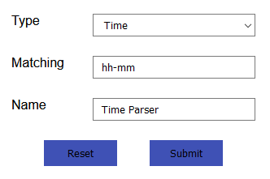
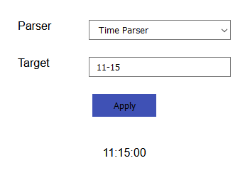
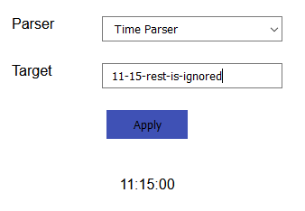

# Home - Create Parser
On this page you can create a rudimentary parser. This means you take a predefined parser
that matches a certain type of data and apply it to data of your choice.
 
For example you could choose the `OneOf` parser that you apply to the input `'DEBUG', 'INFO', 'ERROR'`. This will create a parser that matches either 'DEBUG' or 'INFO' or 'ERROR'.

Currently the page looks like this.

Now let's look at the different parts of the page.

## Create specialized parsers
In this section you can create a parser that matches the string or pattern you give it.
 
You select a type of parser (via the dropdown) and the value or values it should match and give it a name. Then you can submit it and a parser will be created. Here a few examples to make this clearer.
 
First if we wish to create a loglevel parser as described in the first section, we would do so as follows:
 

And if we wanted to create a parser matching a time format like this 'HH-MM' we could do so like this:
 

## Test existing parsers
Since it would be helpful to test if a created parser actually works, this section allows you to select an existing parser by name via the dropdown. You can then provide a target string which the parser will attempt to parse. The result is then displayed as a string below the input fields.

For example with our previously created time parser.
 

If we provide a string that is too long, it still works, as long as it can match the start.
 

