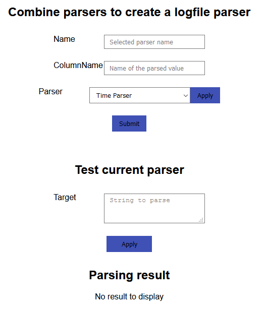
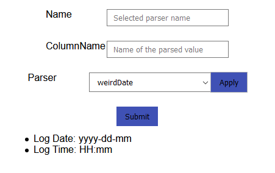

# Create logfile-parser
This page allows a user to combine the previously created rudimentary parsers. The combination can then be used to parse a logline and therefore repeated application will parse a logfile.

Currently the page looks like this.
 

# Combine parsers to create a logfile parser
First you can choose a name for your logfile parser, used to reference it later on.
Then you can use the dropdown to choose an existing rudimentary parser and, using `Apply` add it to the logfile parser.

As an example, if we wanted to parse a datetime of format *YYYY-DD-MMHH:MM* we could first add the `clockTime` parser which matches *HH:MM*.
 

Then we can add the parser called `weirdDate` which matches the format *YYYY-DD-MM*.
 

Now to create this parser, you can enter a name and press the `Submit` button, or if you want to
test it first, move on to the next section.

# Test current parser
In the debug view shown in the image of the last section, you currently see which parsers you added and in which order, from top to bottom, they will be applied.
 
If you want to test it, you can use the textarea below, similarly to the create parser page.
If you add *2000-10-1111:30* to the textarea and press `Apply` the current result changes from nothing to this.
 

As you can see, it separated the string at the correct position and split it into two results. The first matching our date parser and the second matching our time parser.
