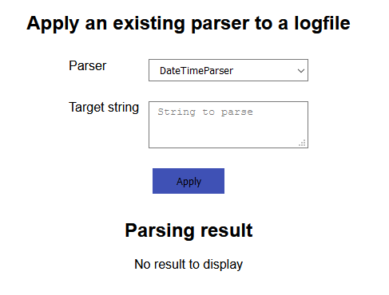
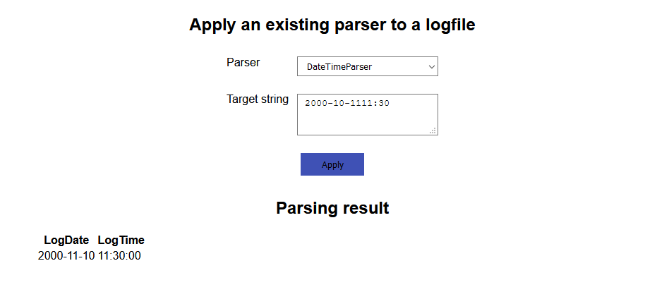

# Apply logfile-parser
On this page you can use the previously create logfile parsers and apply them to the a logfile (at the moment only via copy paste).

Currently the page looks like this.
 

## Apply an existing parser to a logfile
To select an existing logfile parser, you can use the dropdown and select them by name.
Then to apply it, copy your file into the textarea and click apply. Below the textarea you will then see the result.
 
For example if we use the `DateTimeParser` created earlier (on the create logfile parser page) matching the pattern *YYYY-DD-MMHH:MM* it looks like this.
 

